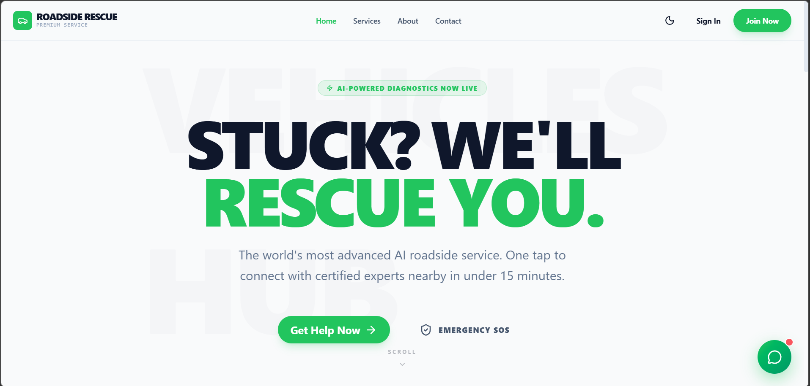

<div align="center">



<br/>


<br/><br/>

[](https://github.com/karthikbm33)&nbsp;
[](./LICENSE)&nbsp;
[](https://github.com/karthikbm33/RoadSide_Rescue_System/stargazers)&nbsp;
[](https://github.com/karthikbm33/RoadSide_Rescue_System/issues)

<br/>

**[🚀 Features](#-features)** &nbsp;•&nbsp;
**[⚙️ Installation](#-getting-started)** &nbsp;•&nbsp;
**[📂 Structure](#-project-structure)** &nbsp;•&nbsp;
**[🗺️ Roadmap](#%EF%B8%8F-roadmap)** &nbsp;•&nbsp;
**[🤝 Contribute](#-contributing)** &nbsp;•&nbsp;
**[📬 Contact](#-support)**

</div>

<br/>


## 🚨 About The Project

<table>
<tr>
<td>

**RoadSide Rescue System** is an emergency response web application designed to help people during road accidents and vehicle breakdowns. It provides a fast, reliable way to connect victims with nearby rescue services, mechanics, and emergency contacts.

> 🎯 **Mission** — Every second counts in an emergency. This system ensures help reaches people as fast as possible.

### 💡 Problem It Solves:
- 🚗 Vehicle breakdown in remote areas
- 🏥 Accident emergency response
- 🔧 Quick mechanic / tow truck finder
- 📞 Emergency contact & SOS alerts
- 🗺️ Real-time location sharing

</td>
</tr>
</table>

<br/>


## ✨ Features

<div align="center">

```
╔══════════════════════════════════════════════════════════════╗
║              🚨  SYSTEM CAPABILITIES                         ║
╠══════════════════════════════════════════════════════════════╣
║  🆘  Emergency SOS Alert System                              ║
║  📍  Real-time Location Detection                            ║
║  🔧  Nearby Mechanic / Service Finder                        ║
║  🚑  Ambulance & Emergency Contact                           ║
║  🔐  User Login & Registration                               ║
║  📋  Rescue Request Management                               ║
║  📊  Admin Dashboard & Control Panel                         ║
║  🗄️  Database-backed Record System                           ║
╚══════════════════════════════════════════════════════════════╝
```

</div>

<br/>


## 🛠️ Tech Stack

<div align="center">

### 🎨 Frontend


### ⚙️ Backend


### 🗄️ Database & Server


### 🛠️ Tools


</div>

<br/>


## 🚀 Getting Started

### 📥 Clone this Repository

```bash
git clone https://github.com/karthikbm33/RoadSide_Rescue_System.git
```

🎉 **You're live!**

<br/>


## 📂 Project Structure

```
📦 RoadSide_Rescue_System/
│
├── frontend/              # Frontend files (UI)
│   ├── index.html
│   ├── styles.css
│   ├── script.js
│   └── assets/           # Images, icons, etc.
│
├── backend/              # Backend server
│   ├── server.js
│   ├── routes/
│   │   ├── userRoutes.js
│   │   ├── serviceRoutes.js
│   │   └── requestRoutes.js
│   │
│   ├── controllers/
│   │   ├── userController.js
│   │   ├── serviceController.js
│   │   └── requestController.js
│   │
│   ├── models/
│   │   ├── User.js
│   │   ├── ServiceProvider.js
│   │   └── Request.js
│   │
│   └── config/
│       └── db.js
│
├── database/             # Database scripts or schema
│   └── schema.sql
│
├── .env                  # Environment variables
├── package.json
├── README.md
└── LICENSE
```

<br/>


## 🗺️ Roadmap

```
Phase 1  ████████████████████  ✅  Core rescue request system
Phase 2  ████████████░░░░░░░░  🔄  UI improvements & bug fixes
Phase 3  ░░░░░░░░░░░░░░░░░░░░  🔮  Google Maps integration
Phase 4  ░░░░░░░░░░░░░░░░░░░░  🔮  SMS / Email alert system
Phase 5  ░░░░░░░░░░░░░░░░░░░░  🔮  Mobile app (Android)
Phase 6  ░░░░░░░░░░░░░░░░░░░░  🔮  Real-time tracking
```

- [x] 🔐 User login & registration
- [x] 🆘 Rescue request system
- [x] 📊 Admin dashboard
- [x] 🗄️ MySQL database integration
- [ ] 🗺️ Google Maps integration *(planned)*
- [ ] 📱 Mobile responsive UI *(planned)*
- [ ] 📧 Email / SMS alerts *(planned)*
- [ ] 📍 Real-time GPS tracking *(planned)*
- [ ] 🤖 AI nearest rescue finder *(planned)*

<br/>


## 🤝 Contributing

Contributions are welcome! Here's how to help:

```
1. 🍴  Fork this repository
2. 🌿  git checkout -b feature/YourFeature
3. ✏️   Make your changes & test locally
4. 📝  git commit -m "feat: add YourFeature"
5. 📤  git push origin feature/YourFeature
6. 🔁  Open a Pull Request
```

### 💡 Ways to Contribute
- 🐞 Fix bugs & report issues
- 🗺️ Add Google Maps integration
- 🎨 Improve UI/UX
- 📱 Make it mobile responsive
- 📝 Improve documentation

<br/>


## 👤 Author

<div align="center">


### **Karthikbm** 🚀
*Developer | Open Source Enthusiast*

<br/>

[](https://github.com/karthikbm33)&nbsp;
[](https://linktr.ee/karthikbm)&nbsp;
[](http://www.linkedin.com/in/karthikbm33)&nbsp;
[](https://x.com/Karthikbm33)&nbsp;
[](mailto:karthikshet21@yahoo.com)

</div>

<br/>

## 💬 Support

| Channel | Link |
|:---|:---|
| 📧 **Email** | [karthikbm5@zohomail.in](mailto:karthikbm5@zohomail.in) |
| 💬 **Telegram** | [Chat\_kpt](https://t.me/Chat_kpt) |
| 🐞 **Bug Report** | [Open an Issue](https://github.com/karthikbm33/RoadSide_Rescue_System/issues/new) |

<br/>

## 📜 License

```
MIT License — Copyright (c) 2025 Karthikbm
Free to use, modify and distribute with attribution.
```

See the full **[LICENSE](./LICENSE)** file for details.

<br/>


<div align="center">

### ⭐ Show Your Support

[](https://github.com/karthikbm33/RoadSide_Rescue_System)&nbsp;
[](https://github.com/karthikbm33/RoadSide_Rescue_System/fork)

<br/>

*Made with ❤️ and ☕ by **[Karthikbm](https://github.com/karthikbm33)***


</div>
